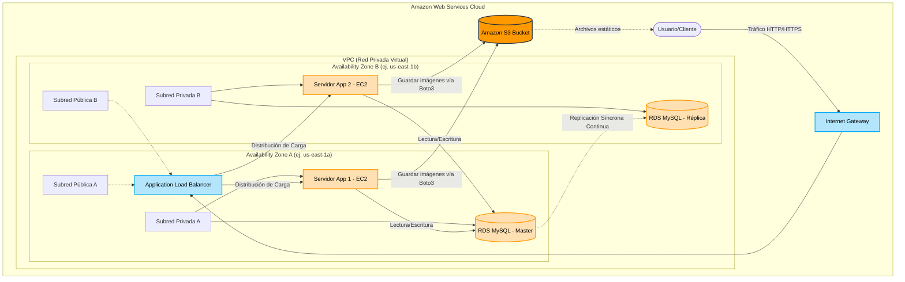

# Diseño Técnico y Diagrama de Arquitectura
**Proyecto**: Sistema de Inventario Nayoli

## Abstracción Lógica del Entorno AWS
El siguiente esquema representa visualmente el flujo de datos y la división de redes del sistema. Cumple con la regla estricta de segmentación: la base de datos (RDS) y los servidores de aplicación (EC2) nunca están expuestos a internet directamente.

### Notas sobre el Diagrama:
1. **Application Load Balancer**: Actúa como un proxy inverso. Si la "Availability Zone A" entera sufre un apagón eléctrico en el datacenter de Amazon, el ALB dirige todo el tráfico automáticamente al Servidor App 2 en la Zona B.
2. **Replicación Síncrona**: Cada transacción guardada en RDS Master (ej. Una salida de inventario) es escrita simultáneamente en el RDS Standby antes de confirmar el éxito. Si el Master falla, AWS promueve automáticamente el Standby a Master en unos 60 segundos (Failover).
